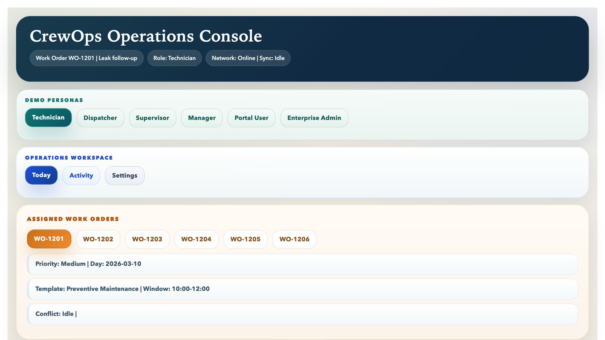
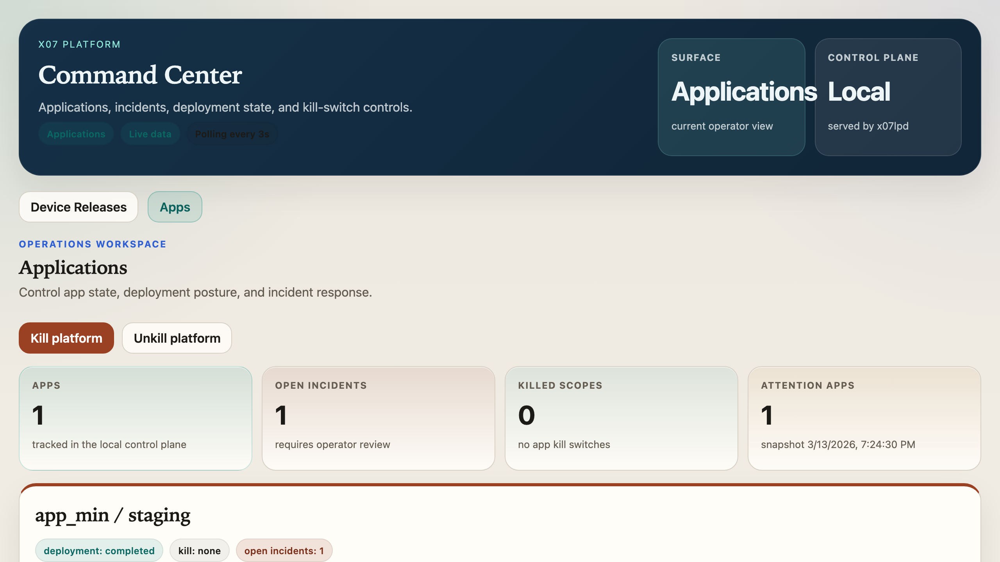
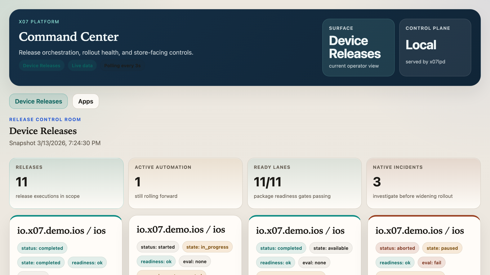
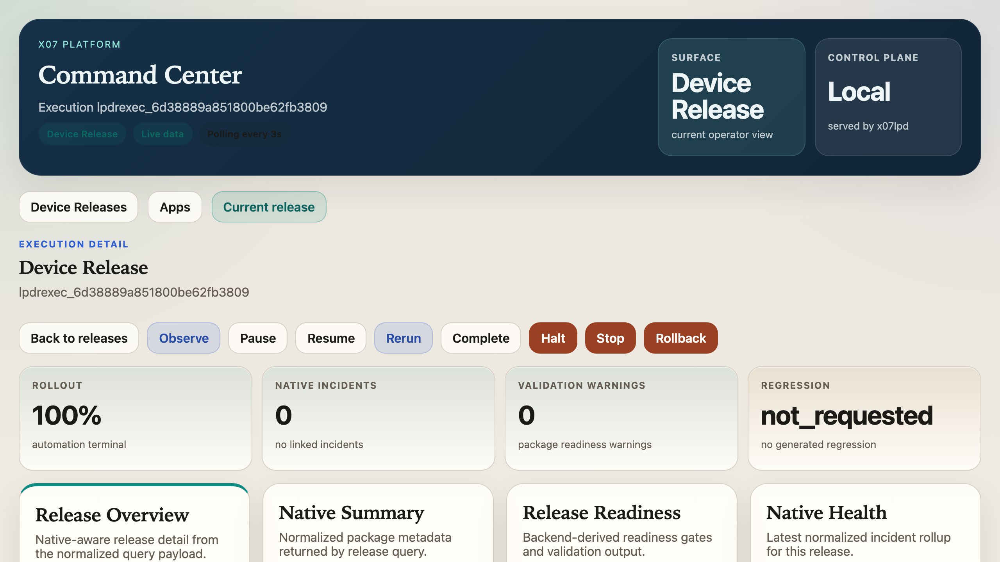
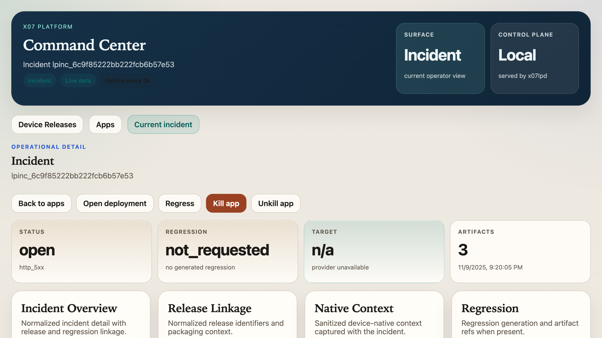

# x07 CrewOps

**CrewOps** is a production-ready field-operations management app built entirely in [X07](https://github.com/x07lang/x07) and compiled to WebAssembly. One codebase, one deterministic reducer, and one seed-backed backend power technician, dispatcher, supervisor, manager, portal, and enterprise-admin workflows — shipping as a **web app**, **desktop app**, and **iOS/Android mobile app** from the same source.

CrewOps is the flagship showcase for the X07 application platform. It proves that a single X07 program can run a serious multi-role business application across every target surface without framework-specific rewrites or platform-specific code.



## Why X07 + WASM

Traditional field-service apps require separate codebases for web, desktop, iOS, and Android — each with its own state management, build system, and deployment pipeline. CrewOps eliminates that entirely:

- **One language, every target.** The X07 reducer compiles to a single `.wasm` module that runs identically in browsers, desktop shells (macOS/Windows/Linux), and mobile WebView containers (iOS/Android). No React Native, no Flutter, no Electron — just WebAssembly.
- **Deterministic by default.** Every user interaction produces the same state transition given the same inputs. This makes the app fully replayable: the entire test suite runs as deterministic trace replay, not flaky integration tests.
- **Offline-first without plugins.** The reducer owns all application state in-process. Field technicians can complete visits, capture evidence, and queue sync operations while disconnected. Reconnect flushes queued ops deterministically.
- **Sealed artifact deployment.** The app compiles into a cryptographically signed pack that deploys through [x07-platform](https://github.com/x07lang/x07-platform) with rollout controls, incident capture, and regression generation — the same lifecycle whether running locally or on a hosted target.
- **No runtime dependencies.** No Node.js server, no database, no Redis. The backend is a deterministic WASI HTTP component that serves structured JSON from a seed. The frontend is a WASM module that renders through `std-web-ui`. Both ship as sealed artifacts.

## What CrewOps Does

CrewOps covers the full lifecycle of a field-service operation: scheduling work, executing it in the field, reviewing quality, billing customers, managing contracts, and giving customers portal access — all in one app.

### Roles

| Role | Home Route | Responsibility |
|------|-----------|---------------|
| **Technician** | `today` | Execute assigned work orders, capture evidence, record labor/parts, sync offline |
| **Dispatcher** | `dispatch` | Schedule and assign jobs, manage queues, track SLA compliance |
| **Supervisor** | `review` | Approve/reject completed work, request corrections, QA loop |
| **Manager** | `manager` | Branch/team dashboards, SLA health, finance, receivables, exports |
| **Portal User** | `portal` | Customer self-service: invoices, service history, estimate approval, requests |
| **Enterprise Admin** | `enterprise` | Tenant administration, branding, inventory, procurement, vendor connectors |

### Feature Areas

- **Field Execution** — check in/out with location capture, dynamic checklists, labor/parts recording, photo evidence, signature capture, offline draft save, and deterministic sync
- **Dispatch Board** — work order intake, assignment/reassignment, branch/team/day/priority filters, SLA tracking, and technician workload visibility
- **Supervisor Review** — approval queue, evidence inspection, reject/correction flows, resubmission tracking, and audit history
- **Finance & Billing** — pricing configuration, invoice generation/issuance/payment, receivables aging, customer statements, and export jobs
- **Estimates & Contracts** — estimate creation and customer approval, conversion to service agreements, recurring work generation, and renewal dashboards
- **Customer Portal** — portal login, invoice and service-history views, estimate approval, service requests, and office handoff conversion
- **Enterprise Admin** — multi-tenant administration, branding/theming, role management, tenant health rollups
- **Inventory & Procurement** — stock tracking, movement recording, cycle counts, purchase orders, partial receiving, and reorder suggestions
- **Vendor Connectors** — connector instance management, provider sync, delivery logs, configuration conflict detection, and health dashboards
- **Integrations** — API key management, webhook delivery, delivery retry, and health monitoring

## Main User Flows

These are the end-to-end paths that demonstrate what CrewOps can do:

### 1. Technician Field Completion

Open `today` as the Technician role. Select work order `WO-1201`. Check in (with optional location capture), fill the inspection checklist, add labor entries and parts, capture photo evidence or import files, record a signature, and complete the visit. Save drafts at any point. The entire flow works offline — queued ops sync automatically on reconnect.

### 2. Dispatcher Scheduling

Switch to the Dispatcher role. The `dispatch` board shows work orders filterable by branch, team, day, status, and priority. Create a new work order, assign it to a technician, then reassign it. Watch the queue update in real time with SLA risk indicators and technician workload strips.

### 3. Supervisor Quality Review

Switch to the Supervisor role. The `review` queue lists submitted visits. Open a completed visit to inspect evidence, checklist responses, labor, parts, and signatures. Approve clean work, reject with a reason code, or request corrections. The technician receives the correction task and can resubmit.

### 4. Manager Operations & Finance

Switch to the Manager role. The `manager` dashboard shows branch rollups, SLA health, overdue counts, and blocked-job metrics. Navigate to `finance` for receivables, `pricing` for rate controls, `invoices` for generation and payment capture, `receivables` for aging analysis, and `exports` for data export jobs with retry.

### 5. Commercial Growth

From the Manager workspace, navigate to `estimates` to build and send an estimate, `contracts` to manage service agreements with pause/resume/renew, `recurring` to generate and skip scheduled work, and `integrations` to inspect webhook delivery health and API keys.

### 6. Customer Portal

Switch to the Portal User role. Log in as `portal_account_001`. Review service history, see invoice status, approve a pending estimate, and submit a service request that converts into office follow-up.

### 7. Enterprise Operations

Switch to the Enterprise Admin role. Open `enterprise` to review tenant `tenant_northline`, update branding, and check tenant health. Navigate to `inventory` for stock levels and movement, `procurement` for purchase orders and partial receiving on `purchase_order_002`, and `integration_dashboard` for connector health and the stale configuration case on `connector_instance_ticketing`.

## Screenshots

| View | Description |
|------|-------------|
|  | Technician home — assigned work orders with status, priority, template, and sync state |
|  | x07-platform Command Center — deployment state, incidents, and kill-switch controls |
|  | Device release rollout — iOS/Android release executions with readiness gates |
|  | Release execution detail — rollout progress, native health, and regression state |
|  | Incident detail — captured incidents with regression generation and artifact links |

## Getting Started

### Prerequisites

Install the X07 toolchain:

```sh
curl -fsSL https://x07lang.org/install.sh | sh -s -- --yes --channel stable
x07up component add wasm
```

Or build from source and add the workspace binaries to `PATH`:

```sh
export PATH="<x07-repo>/target/debug:<x07-wasm-backend-repo>/target/debug:$PATH"
```

### Build and Run Locally

From the repo root:

```sh
# Generate demo seed data
./scripts/ci/seed_demo.sh

# Lock frontend dependencies
x07 pkg lock --project frontend/x07.json

# Check frontend and backend
x07 check --project frontend/x07.json
x07 check --project backend/x07.json

# Run tests
x07 test --manifest frontend/tests/tests.json
x07 test --manifest backend/tests/tests.json

# Build the web app
x07-wasm app build --index arch/app/ops/index.x07ops.json --profile crewops_dev --out-dir dist/app/crewops_dev --clean

# Serve the web app locally
x07-wasm app serve --dir dist/app/crewops_dev
```

The web app will be available at `http://127.0.0.1:17080` (frontend) with the backend at `http://127.0.0.1:17081`.

### Build Desktop App

```sh
x07-wasm device build --index arch/device/index.x07device.json --profile device_desktop_dev --out-dir dist/device/device_desktop_dev --clean
x07-wasm device verify --dir dist/device/device_desktop_dev
x07-wasm device run --bundle dist/device/device_desktop_dev --target desktop --headless-smoke
```

### Build Mobile Apps

```sh
# iOS
x07-wasm device build --index arch/device/index.x07device.json --profile device_ios_dev --out-dir dist/device/device_ios_dev --clean
x07-wasm device package --bundle dist/device/device_ios_dev --target ios --out-dir dist/device_package/device_ios_dev

# Android
x07-wasm device build --index arch/device/index.x07device.json --profile device_android_dev --out-dir dist/device/device_android_dev --clean
x07-wasm device package --bundle dist/device/device_android_dev --target android --out-dir dist/device_package/device_android_dev
```

iOS generates an Xcode project at `dist/device_package/device_ios_dev/ios_project/`. Android generates a Gradle project at `dist/device_package/device_android_dev/android_project/`.

### Run the Full CI Gate

```sh
./scripts/ci/check_all.sh
```

This runs the canonical 12-step pipeline: lock verification, frontend/backend checks, deterministic trace replay, generated regression replay, app pack/verify/provenance, deploy-plan generation, desktop smoke, and iOS/Android package generation.

## Deployment with x07-platform

CrewOps deploys as a sealed, signed artifact through [**x07-platform**](https://github.com/x07lang/x07-platform) — the X07 lifecycle runtime and control plane.

The deployment flow:

1. `check_all.sh` produces a signed `app.pack` with provenance attestation
2. `x07-platform` admits the pack and generates a deploy plan
3. The platform executes the rollout with automated readiness gates
4. Incidents are captured from live traffic and generate regression traces
5. Operators control the rollout through pause, rerun, rollback, stop, and kill-switch actions
6. Device releases (iOS/Android) go through a separate staged release pipeline with native health checks

The same sealed pack deploys to local targets today and to self-hosted or managed targets without app-code changes.

## Release Artifacts

Pre-built release artifacts are available in the [`releases/`](releases/) directory:

| Target | Artifact | Description |
|--------|----------|-------------|
| Web | `releases/web/` | Static web app — serve with any HTTP server |
| Desktop | `releases/desktop/` | Desktop device bundle for macOS/Windows/Linux |
| iOS | `releases/ios/` | Xcode project ready for simulator or device build |
| Android | `releases/android/` | Gradle project ready for emulator or device build |

All targets run the same WASM reducer and produce identical state transitions.

## Architecture

```
x07-crewops/
  frontend/          # X07 reducer — one shared state tree for all roles
    src/app.x07.json # Main reducer (~170 functions, UI rendering, state machine)
    src/entities.x07.json   # Normalized entity maps and indexes
    src/drafts.x07.json     # Intake, pricing, invoice, and commercial drafts
    src/sync.x07.json       # Deterministic sync state and conflict metadata
    src/execution.x07.json  # Technician visit state machine
    src/routes.x07.json     # Role-aware route selection
  backend/           # Deterministic WASI HTTP component — seed-backed API
    src/app.x07.json # API router
    src/demo_seed.x07.json  # Generated demo data
  arch/              # App, web UI, device, SLO, and provenance profiles
  tests/             # Deterministic traces, incidents, and regressions
  scripts/ci/        # Seed generation and canonical gate
  docs/              # Architecture, data model, and feature documentation
  releases/          # Pre-built artifacts for all targets
```

## Documentation

| Document | Description |
|----------|-------------|
| [`docs/ARCHITECTURE.md`](docs/ARCHITECTURE.md) | Repo layers, reducer structure, backend surface, seed/sync model |
| [`docs/DATA_MODEL.md`](docs/DATA_MODEL.md) | Entity definitions, state machines, sync schemas |
| [`docs/DEMO_WALKTHROUGH.md`](docs/DEMO_WALKTHROUGH.md) | Step-by-step M7 demo script |
| [`docs/DISPATCH_AND_REVIEW.md`](docs/DISPATCH_AND_REVIEW.md) | Dispatcher board and supervisor review queue |
| [`docs/MANAGER_DASHBOARDS.md`](docs/MANAGER_DASHBOARDS.md) | Manager operations and finance dashboards |
| [`docs/PORTAL.md`](docs/PORTAL.md) | Customer portal routes and sync state |
| [`docs/ENTERPRISE_ADMIN.md`](docs/ENTERPRISE_ADMIN.md) | Tenant administration and branding |
| [`docs/INVENTORY_AND_PROCUREMENT.md`](docs/INVENTORY_AND_PROCUREMENT.md) | Stock tracking and purchase orders |
| [`docs/VENDOR_CONNECTORS.md`](docs/VENDOR_CONNECTORS.md) | Connector health and delivery monitoring |
| [`docs/MOBILE_BUILD.md`](docs/MOBILE_BUILD.md) | Device profiles, capabilities, and packaging |
| [`docs/RELEASE_READINESS.md`](docs/RELEASE_READINESS.md) | Gate requirements and release checklist |
| [`docs/HOSTED_READINESS.md`](docs/HOSTED_READINESS.md) | Hosted deployment readiness surface |

## Current Version

- **Release:** `v0.7.0` (milestone line: `v0.6.0` / M7)
- **Frontend baseline:** `std-web-ui@0.2.5`
- **Schema:** `x07.project@0.3.0`, `x07.x07ast@0.5.0`
- **Demo seed:** generated by `scripts/ci/seed_demo.sh`

## License

See the repository root for license terms.
