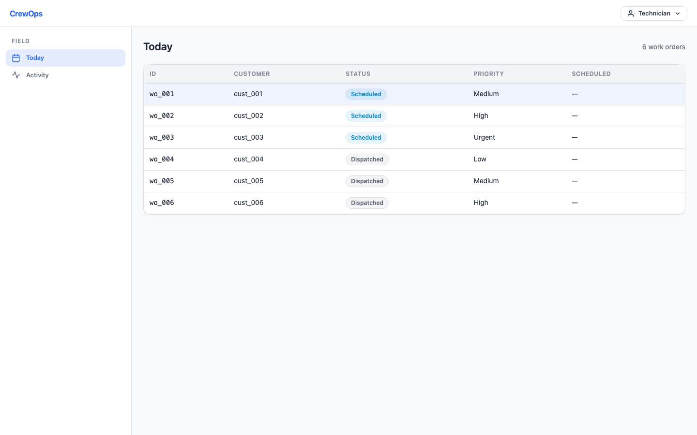
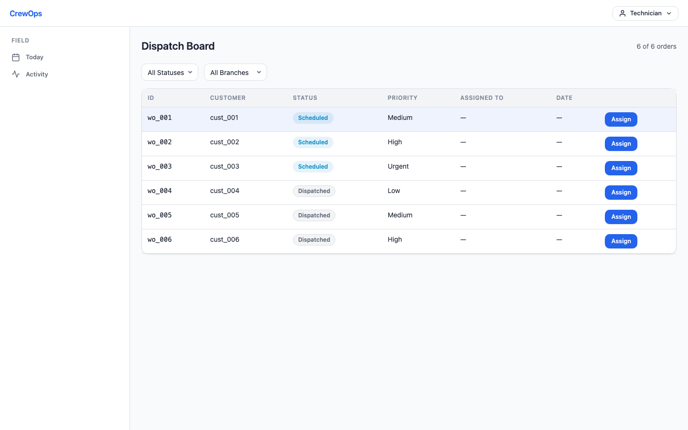
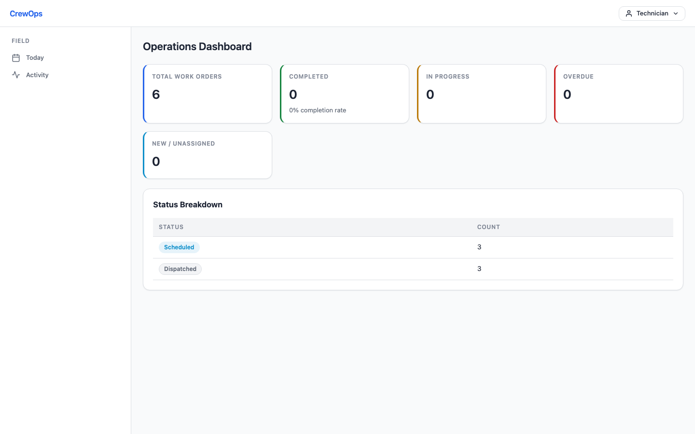

# x07 CrewOps

## Agent Entrypoint

Start here: https://x07lang.org/docs/getting-started/agent-quickstart

**CrewOps** is a demo application that showcases the ability of [X07](https://github.com/x07lang/x07) to build real, multi-target WASM UI applications from a single codebase. One X07 program compiles to WebAssembly and ships as a **web app**, **desktop app** (macOS/Windows/Linux), and **native mobile app** (iOS/Android) — with zero platform-specific code.

> **This is a technology demo, not a production product.** CrewOps uses deterministic seed data and a stateless backend to demonstrate X07's capabilities. The goal is to prove that a single language and runtime can power a serious multi-role business application across every target surface — browser, desktop shell, and mobile WebView — without React Native, Flutter, Electron, or any framework-specific rewrites.







## What Is In This Repo

This repo contains one complete showcase app for the X07 ecosystem:

- a shared X07 frontend reducer that renders the same product across web, desktop, iOS, and Android
- a deterministic X07 backend used for demo APIs and replayable test flows
- app, web-ui, device, provenance, and release profiles under `arch/`
- deterministic traces, incidents, and regression fixtures under `tests/`
- release-ready demo artifacts and walkthrough docs under `releases/` and `docs/`

## Vision

CrewOps exists to make the whole X07 story concrete for end users.

The vision is simple: if X07 claims that an agent can build one serious application, keep it memory-safe and deterministic, and ship it across browser and device targets without rewriting the app for every platform, CrewOps should prove that claim in a form people can run and inspect.

## How CrewOps Fits The X07 Ecosystem

CrewOps is not the language itself. It is the "whole product" example that ties the ecosystem together:

- [`x07`](https://github.com/x07lang/x07) provides the language, toolchain, diagnostics, and canonical docs
- [`x07-web-ui`](https://github.com/x07lang/x07-web-ui) provides the reducer-based UI contracts
- [`x07-wasm-backend`](https://github.com/x07lang/x07-wasm-backend) builds the WASM app, web, and device bundles
- [`x07-device-host`](https://github.com/x07lang/x07-device-host) runs the same reducer inside desktop and mobile system WebViews
- [`x07-platform`](https://github.com/x07lang/x07-platform) turns the app pack into a staged release with deploy, incident, and regression workflows

If someone asks, "What does the full x07 stack look like when it becomes a real app?", CrewOps is the answer in this repo.

## Practical Usage

CrewOps is useful in three ways:

- as a product demo for teams evaluating whether X07 can power a serious line-of-business app
- as a reference repo for agents and developers building a cross-target web-ui/device app
- as an end-to-end validation target for the wider X07 release train

## What This Demo Proves

CrewOps exists to answer one question: **can a single language compile to WASM and run a real application on every platform?**

| Capability | How CrewOps demonstrates it |
|---|---|
| **One binary, every target** | The same `.wasm` reducer runs in the browser, inside a desktop system-WebView shell, and inside iOS/Android WebView containers — bit-for-bit identical |
| **Real UI, not a toy** | 6 user roles, 23 routes, 170+ reducer functions, production CSS with gradients/shadows/transitions/responsive layout |
| **Deterministic replay** | Every interaction produces the same state. The full test suite is 42 deterministic trace replays, not flaky browser tests |
| **Offline-first by design** | The reducer owns all state in-process. Field work completes offline; reconnect flushes queued ops deterministically |
| **Sealed deployment** | The app compiles into a signed pack that deploys through [x07-platform](https://github.com/x07lang/x07-platform) with rollout gates, incident capture, and regression generation |
| **Zero runtime dependencies** | No Node.js, no database, no Redis. The backend is a WASI HTTP component serving seed data. The frontend is a WASM module rendering through `std-web-ui` |

### Targets built from the same source

```
x07-crewops/
  frontend/src/app.x07.json   -->  app.wasm  -->  Browser (any modern browser)
                                              -->  Desktop (macOS / Windows / Linux)
                                              -->  iOS (Xcode project + WebView)
                                              -->  Android (Gradle project + WebView)
```

No conditional compilation, no `#ifdef MOBILE`, no platform adapters. The same reducer, the same state machine, the same UI.

## What CrewOps Does

CrewOps covers the full lifecycle of a field-service operation: scheduling work, executing it in the field, reviewing quality, billing customers, managing contracts, and giving customers portal access — all in one app.

### Roles

| Role | Home Route | Responsibility |
|------|-----------|---------------|
| **Technician** | `today` | Execute assigned work orders, capture evidence, record labor/parts, sync offline |
| **Dispatcher** | `dispatch` | Schedule and assign jobs, manage queues, track SLA compliance |
| **Supervisor** | `review` | Approve/reject completed work, request corrections, QA loop |
| **Manager** | `manager` | Branch/team dashboards, SLA health, finance, receivables, exports |
| **Portal User** | `portal` | Customer self-service: invoices, service history, estimate approval, requests |
| **Enterprise Admin** | `enterprise` | Tenant administration, branding, inventory, procurement, vendor connectors |

### Feature Areas

- **Field Execution** — check in/out with location capture, dynamic checklists, labor/parts recording, photo evidence, signature capture, offline draft save, and deterministic sync
- **Dispatch Board** — work order intake, assignment/reassignment, branch/team/day/priority filters, SLA tracking, and technician workload visibility
- **Supervisor Review** — approval queue, evidence inspection, reject/correction flows, resubmission tracking, and audit history
- **Finance & Billing** — pricing configuration, invoice generation/issuance/payment, receivables aging, customer statements, and export jobs
- **Estimates & Contracts** — estimate creation and customer approval, conversion to service agreements, recurring work generation, and renewal dashboards
- **Customer Portal** — portal login, invoice and service-history views, estimate approval, service requests, and office handoff conversion
- **Enterprise Admin** — multi-tenant administration, branding/theming, role management, tenant health rollups
- **Inventory & Procurement** — stock tracking, movement recording, cycle counts, purchase orders, partial receiving, and reorder suggestions
- **Vendor Connectors** — connector instance management, provider sync, delivery logs, configuration conflict detection, and health dashboards
- **Integrations** — API key management, webhook delivery, delivery retry, and health monitoring

## Main User Flows

These are the end-to-end paths that demonstrate what CrewOps can do:

### 1. Technician Field Completion

Open `today` as the Technician role. Select work order `WO-1201`. Check in (with optional location capture), fill the inspection checklist, add labor entries and parts, capture photo evidence or import files, record a signature, and complete the visit. Save drafts at any point. The entire flow works offline — queued ops sync automatically on reconnect.

### 2. Dispatcher Scheduling

Switch to the Dispatcher role. The `dispatch` board shows work orders filterable by branch, team, day, status, and priority. Create a new work order, assign it to a technician, then reassign it. Watch the queue update in real time with SLA risk indicators and technician workload strips.

### 3. Supervisor Quality Review

Switch to the Supervisor role. The `review` queue lists submitted visits. Open a completed visit to inspect evidence, checklist responses, labor, parts, and signatures. Approve clean work, reject with a reason code, or request corrections. The technician receives the correction task and can resubmit.

### 4. Manager Operations & Finance

Switch to the Manager role. The `manager` dashboard shows branch rollups, SLA health, overdue counts, and blocked-job metrics. Navigate to `finance` for receivables, `pricing` for rate controls, `invoices` for generation and payment capture, `receivables` for aging analysis, and `exports` for data export jobs with retry.

### 5. Commercial Growth

From the Manager workspace, navigate to `estimates` to build and send an estimate, `contracts` to manage service agreements with pause/resume/renew, `recurring` to generate and skip scheduled work, and `integrations` to inspect webhook delivery health and API keys.

### 6. Customer Portal

Switch to the Portal User role. Log in as `portal_account_001`. Review service history, see invoice status, approve a pending estimate, and submit a service request that converts into office follow-up.

### 7. Enterprise Operations

Switch to the Enterprise Admin role. Open `enterprise` to review tenant `tenant_northline`, update branding, and check tenant health. Navigate to `inventory` for stock levels and movement, `procurement` for purchase orders and partial receiving on `purchase_order_002`, and `integration_dashboard` for connector health and the stale configuration case on `connector_instance_ticketing`.

## Getting Started

### Prerequisites

Install the X07 toolchain:

```sh
curl -fsSL https://x07lang.org/install.sh | sh -s -- --yes --channel stable
x07up component add wasm
```

Or build from source and add the workspace binaries to `PATH`:

```sh
export PATH="<x07-repo>/target/debug:<x07-wasm-backend-repo>/target/debug:$PATH"
```

### Use CrewOps As Part Of The X07 Ecosystem

The normal ecosystem path is:

1. Install the core toolchain from [`x07`](https://github.com/x07lang/x07).
2. Add the WASM component with `x07up component add wasm`.
3. Build and test the app here with `x07-wasm`.
4. Package desktop or mobile targets with the device flow.
5. Promote the sealed artifact through [`x07-platform`](https://github.com/x07lang/x07-platform) when you want the lifecycle story.

### Build and Run Locally

From the repo root:

```sh
# Generate demo seed data
./scripts/ci/seed_demo.sh

# Lock frontend dependencies
x07 pkg lock --project frontend/x07.json

# Check frontend and backend
x07 check --project frontend/x07.json
x07 check --project backend/x07.json

# Run tests
x07 test --manifest frontend/tests/tests.json
x07 test --manifest backend/tests/tests.json

# Build the web app
x07-wasm app build --index arch/app/ops/index.x07ops.json --profile crewops_dev --out-dir dist/app/crewops_dev --clean

# Serve the web app locally
x07-wasm app serve --dir dist/app/crewops_dev
```

The web app will be available at `http://127.0.0.1:17080` (frontend) with the backend at `http://127.0.0.1:17081`.

### Build Desktop App

```sh
x07-wasm device build --index arch/device/index.x07device.json --profile device_desktop_dev --out-dir dist/device/device_desktop_dev --clean
x07-wasm device verify --dir dist/device/device_desktop_dev
x07-wasm device run --bundle dist/device/device_desktop_dev --target desktop --headless-smoke
```

### Build Mobile Apps

```sh
# iOS
x07-wasm device build --index arch/device/index.x07device.json --profile device_ios_dev --out-dir dist/device/device_ios_dev --clean
x07-wasm device package --bundle dist/device/device_ios_dev --target ios --out-dir dist/device_package/device_ios_dev

# Android
x07-wasm device build --index arch/device/index.x07device.json --profile device_android_dev --out-dir dist/device/device_android_dev --clean
x07-wasm device package --bundle dist/device/device_android_dev --target android --out-dir dist/device_package/device_android_dev
```

iOS generates an Xcode project at `dist/device_package/device_ios_dev/ios_project/`. Android generates a Gradle project at `dist/device_package/device_android_dev/android_project/`.

### Run the Full CI Gate

```sh
./scripts/ci/check_all.sh
```

This runs the canonical 12-step pipeline: lock verification, frontend/backend checks, deterministic trace replay, generated regression replay, app pack/verify/provenance, deploy-plan generation, desktop smoke, and iOS/Android package generation.

## Deployment with x07-platform

CrewOps deploys as a sealed, signed artifact through [**x07-platform**](https://github.com/x07lang/x07-platform) — the X07 lifecycle runtime and control plane.

The deployment flow:

1. `check_all.sh` produces a signed `app.pack` with provenance attestation
2. `x07-platform` admits the pack and generates a deploy plan
3. The platform executes the rollout with automated readiness gates
4. Incidents are captured from live traffic and generate regression traces
5. Operators control the rollout through pause, rerun, rollback, stop, and kill-switch actions
6. Device releases (iOS/Android) go through a separate staged release pipeline with native health checks

The same sealed pack deploys to local targets today and to self-hosted or managed targets without app-code changes.

For a command-by-command walkthrough (local + self-hosted wasmCloud), see [`docs/DEPLOY_WITH_X07_PLATFORM.md`](docs/DEPLOY_WITH_X07_PLATFORM.md).

## Install And Use The Repo Itself

If you only want to inspect the app locally, you do not need the whole release loop:

- install X07 and the WASM component
- run the local build commands in this README
- open the served app in a browser, or run the desktop/device packaging flow

If you want the full release story, pair this repo with `x07-platform` and the related packaging/runtime repos listed above.

## Release Artifacts

Pre-built demo artifacts from the same source are in [`releases/`](releases/):

| Target | Artifact | What it proves |
|--------|----------|----------------|
| **Web** | `releases/web/` | Static files — serve with any HTTP server, runs in any modern browser |
| **Desktop** | `releases/desktop/` | System-WebView shell — same reducer, native window, file import, local notifications |
| **iOS** | `releases/ios/` | Xcode project — same reducer inside a WKWebView with camera, location, blob storage |
| **Android** | `releases/android/` | Gradle project — same reducer inside an Android WebView with the same native bridges |

Every target runs the **exact same `.wasm` binary** and produces **identical state transitions** given the same inputs. The only difference is the native capability surface exposed by each host.

## Architecture

```
x07-crewops/
  frontend/          # X07 reducer — one shared state tree for all roles
    src/app.x07.json # Main reducer (~170 functions, UI rendering, state machine)
    src/entities.x07.json   # Normalized entity maps and indexes
    src/drafts.x07.json     # Intake, pricing, invoice, and commercial drafts
    src/sync.x07.json       # Deterministic sync state and conflict metadata
    src/execution.x07.json  # Technician visit state machine
    src/routes.x07.json     # Role-aware route selection
  backend/           # Deterministic WASI HTTP component — seed-backed API
    src/app.x07.json # API router
    src/demo_seed.x07.json  # Generated demo data
  arch/              # App, web UI, device, SLO, and provenance profiles
  tests/             # Deterministic traces, incidents, and regressions
  scripts/ci/        # Seed generation and canonical gate
  docs/              # Architecture, data model, and feature documentation
  releases/          # Pre-built artifacts for all targets
```

## Documentation

| Document | Description |
|----------|-------------|
| [`docs/ARCHITECTURE.md`](docs/ARCHITECTURE.md) | Repo layers, reducer structure, backend surface, seed/sync model |
| [`docs/DATA_MODEL.md`](docs/DATA_MODEL.md) | Entity definitions, state machines, sync schemas |
| [`docs/DEMO_WALKTHROUGH.md`](docs/DEMO_WALKTHROUGH.md) | Step-by-step M7 demo script |
| [`docs/DISPATCH_AND_REVIEW.md`](docs/DISPATCH_AND_REVIEW.md) | Dispatcher board and supervisor review queue |
| [`docs/MANAGER_DASHBOARDS.md`](docs/MANAGER_DASHBOARDS.md) | Manager operations and finance dashboards |
| [`docs/PORTAL.md`](docs/PORTAL.md) | Customer portal routes and sync state |
| [`docs/ENTERPRISE_ADMIN.md`](docs/ENTERPRISE_ADMIN.md) | Tenant administration and branding |
| [`docs/INVENTORY_AND_PROCUREMENT.md`](docs/INVENTORY_AND_PROCUREMENT.md) | Stock tracking and purchase orders |
| [`docs/VENDOR_CONNECTORS.md`](docs/VENDOR_CONNECTORS.md) | Connector health and delivery monitoring |
| [`docs/MOBILE_BUILD.md`](docs/MOBILE_BUILD.md) | Device profiles, capabilities, and packaging |
| [`docs/DEPLOY_WITH_X07_PLATFORM.md`](docs/DEPLOY_WITH_X07_PLATFORM.md) | Step-by-step x07-platform deploy tutorial (local + self-hosted wasmCloud) |
| [`docs/RELEASE_READINESS.md`](docs/RELEASE_READINESS.md) | Gate requirements and release checklist |
| [`docs/HOSTED_READINESS.md`](docs/HOSTED_READINESS.md) | Hosted deployment readiness surface |

## Demo Limitations

CrewOps is a technology demo, not a production deployment:

- **Seed data only** — the backend serves deterministic JSON from a generated seed, not a database
- **No authentication** — role switching is instant via demo persona buttons
- **No persistent storage** — state resets on page reload
- **Mobile profiles need a real backend URL** — iOS/Android dev profiles point at `example.invalid` by default

These are intentional. The demo proves the platform capability (one WASM binary, every target, deterministic replay); a production app would add a real database, auth, and backend infrastructure on top of the same reducer.

## Current Version

- **Release:** `v0.7.0` (milestone line: `v0.6.0` / M7)
- **Frontend baseline:** `std-web-ui@0.2.5`
- **Schema:** `x07.project@0.3.0`, `x07.x07ast@0.5.0`
- **Demo seed:** generated by `scripts/ci/seed_demo.sh`

## License

See the repository root for license terms.
